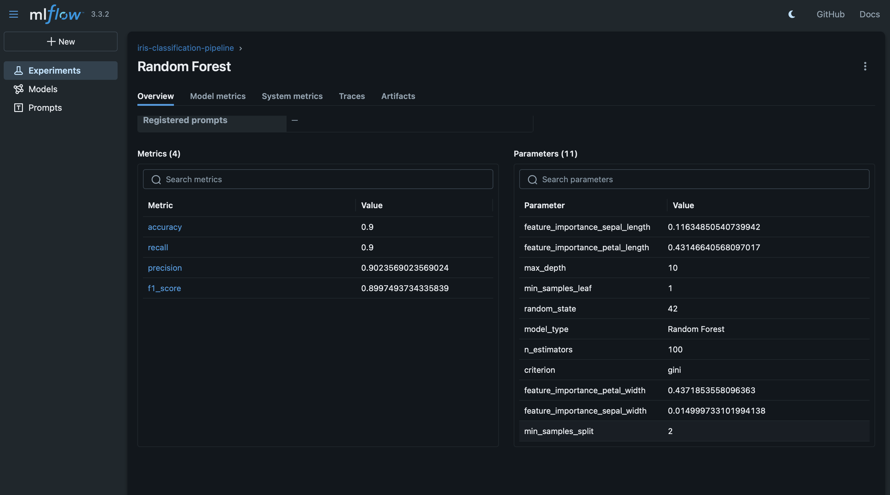
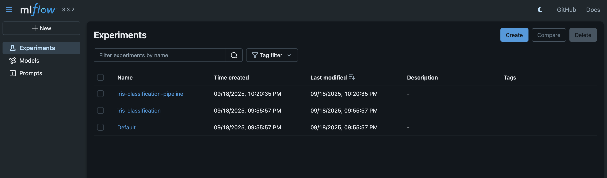

# Iris Classification MLOps Pipeline

This project implements a comprehensive MLOps pipeline for the Iris flower classification problem, showcasing best practices in machine learning operations including experiment tracking, model versioning, and automated pipeline execution.

## Project Structure

```
mlops-assignment-1/
├── data/                    # Training and testing datasets
│   ├── X_test.npy
│   ├── X_train.npy
│   ├── y_test.npy
│   └── y_train.npy
├── models/                  # Saved model files
│   ├── logistic_regression_model.pkl
│   ├── random_forest_model.pkl
│   └── support_vector_machine_model.pkl
├── notebooks/              # Jupyter notebooks for exploration and training
│   ├── 01_data_exploration.ipynb
│   └── 02_model_training.ipynb
├── results/                # Visualization and results
│   ├── correlation_heatmap.png
│   ├── iris_pairplot.png
│   ├── model_comparison.png
│   └── *_confusion_matrix.png
├── src/                    # Source code
│   ├── logistic_regression.py
│   ├── mlflow_config.py
│   ├── random_forest.py
│   ├── svm.py
│   └── utils.py
├── mlruns/                 # MLflow tracking files
├── requirements.txt        # Project dependencies

```

## Dataset

The project uses the classic Iris dataset:
- **150 samples** of iris flowers
- **4 features**: sepal length, sepal width, petal length, petal width
- **3 classes**: Setosa, Versicolor, Virginica
- **Balanced classes**: 50 samples per class

## Models and Performance

### Support Vector Machine (Latest Run)
- **Best Performing Model**
- Accuracy: 96.7%
- Precision: 96.7%
- Recall: 96.7%
- F1 Score: 96.7%
- Parameters:
  - Kernel: rbf
  - Gamma: scale
  - Random State: 42

### Random Forest (Latest Run)
- Accuracy: 90.0%
- Precision: 90.2%
- Recall: 90.0%
- F1 Score: 90.0%
- Parameters:
  - n_estimators: 100
  - max_depth: 10
  - min_samples_split: 2
  - min_samples_leaf: 1
  - criterion: gini
  - Feature Importance:
    - Petal Length: 0.432
    - Petal Width: 0.437
    - Sepal Length: 0.116
    - Sepal Width: 0.015

## MLflow Experiment Tracking

The project leverages MLflow for comprehensive experiment tracking and model management:

### Experiment Dashboard

*Overview of all experiment runs showing model performance and training times*

### Model Performance Tracking

#### Random Forest Metrics

*Detailed metrics for Random Forest model showing accuracy, precision, recall, and feature importance*

Parameters:
- n_estimators: 100
- max_depth: 10
- criterion: gini
- Feature importance analysis shows petal dimensions are most significant

#### Support Vector Machine Metrics

*Performance metrics for SVM model demonstrating 96.7% accuracy across all metrics*

Parameters:
- kernel: rbf
- gamma: scale
- random_state: 42

### Latest Experiment Details
- Experiment name: iris-classification-pipeline
- Best performing model: Support Vector Machine (96.7% accuracy)
- Total runs tracked: 6 runs
- Registered models: iris-classifier-best (v2)
- Latest run duration: 4.3s

### Tracked Components
- Model parameters and hyperparameters
- Performance metrics (accuracy, precision, recall, f1-score)
- Model artifacts and serialized models
- Feature importance (for Random Forest)
- Confusion matrices and performance visualizations
- Run metadata (duration, timestamps, source)

### Visualization Artifacts
- Model comparison plots
- Confusion matrices for each model
- Feature importance plots for Random Forest
- Data distribution visualizations

## Setup and Execution

1. **Clone and Install**
   ```bash
   git clone https://github.com/AreebDastgeer/ML_ops_A01.git
   cd mlops-assignment-1
   pip install -r requirements.txt
   ```

2. **Run Complete Pipeline**
   ```bash
   python run_pipeline.py
   ```
   This will:
   - Load and preprocess data
   - Train all models
   - Track experiments in MLflow
   - Save artifacts and visualizations

3. **View MLflow Dashboard**
   ```bash
   mlflow ui
   ```
   Access the dashboard at `http://localhost:5000`

4. **Explore Notebooks** (Optional)
   ```bash
   jupyter notebook notebooks/
   ```
   - `01_data_exploration.ipynb`: Dataset analysis
   - `02_model_training.ipynb`: Model development

## Development Environment

- Python 3.10+
- Key Dependencies:
  - scikit-learn
  - mlflow
  - numpy
  - pandas
  - matplotlib
  - seaborn

## Visualizations

### Data Analysis

*Pairplot showing the relationships between different features across Iris species*


*Correlation heatmap showing feature relationships*

### Model Performance

#### Support Vector Machine

*Confusion Matrix for Support Vector Machine (Best Model)*

#### Random Forest

*Confusion Matrix for Random Forest Classifier*

#### Logistic Regression

*Confusion Matrix for Logistic Regression*

#### Model Comparison

*Performance comparison across all models*

## Future Improvements

1. Implement hyperparameter optimization
2. Add cross-validation
3. Experiment with additional models
4. Add model serving capabilities
5. Implement CI/CD pipeline

## Repository Information

- Author: Areeb Dastgeer
- Version: 1.0.0
- License: MIT
- Last Updated: September 18, 2025

## Model Registration & Deployment

### Best Model Selection
The **Support Vector Machine (SVM)** was identified as the best performing model based on accuracy (96.67%).

### Model Registry Process
1. **Automatic Selection**: Best model identified based on accuracy metric
2. **Registration**: Model registered in MLflow Model Registry as `iris-classifier-best`
3. **Versioning**: Model version 1 created with performance metadata
4. **Description**: "Best performing iris classifier with accuracy: 96.67%"

### Model Registry Details
- **Model Name**: `iris-classifier-best`
- **Version**: 1
- **Stage**: None (newly registered)
- **Run ID**: `ed67ca2912844ef881a41fd994f9d8c8`
- **Model Type**: Support Vector Machine with RBF kernel

### Accessing Registered Model
```python
import mlflow.sklearn

# Load the registered model
model = mlflow.sklearn.load_model("models:/iris-classifier-best/1")

# Make predictions
predictions = model.predict(X_test)
```

## Results & Visualizations

### Model Comparison
| Model | Accuracy | Precision | Recall | F1-Score |
|-------|----------|-----------|---------|----------|
| SVM | **96.67%** | **96.97%** | **96.67%** | **96.66%** |
| Logistic Regression | 93.33% | 93.33% | 93.33% | 93.33% |
| Random Forest | 90.00% | 90.24% | 90.00% | 89.97% |

### Generated Artifacts
- **Pairplot**: Feature relationships by species
- **Correlation Matrix**: Feature correlation heatmap
- **Confusion Matrices**: Per-model classification results
- **Model Comparison**: Performance metrics visualization

## MLflow Monitoring & Observability

### Experiment Tracking
- **3 successful runs** logged to MLflow
- **Comprehensive metrics** tracked for each model
- **Reproducible experiments** with seeded random states
- **Artifact logging** for analysis and debugging

### Model Performance Monitoring
- Real-time metric comparison across models
- Historical run tracking and comparison
- Parameter impact analysis available through MLflow UI

## Assignment Completion Status

✅ **Part 1 - GitHub Setup**: Repository created with proper structure  
✅ **Part 2 - Model Training**: 3 models trained with comprehensive evaluation  
✅ **Part 3 - MLflow Tracking**: Complete experiment tracking with artifacts  
✅ **Part 4 - Model Registration**: Best model registered with version control  

**Final Score**: SVM achieved **96.67% accuracy** and is registered as the production model.
